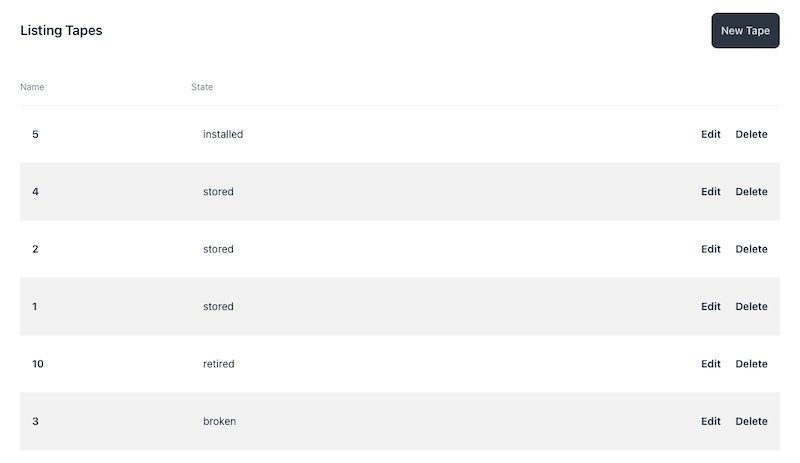

# Tape Tracker

A real-time web application designed to help you manage your physical backup tapes with ease.

## Key features

* **Real-time events**: Monitor the status of each tape (e.g., installed,
    stored, broken, retired)
* **Backup History**: Record the date and time of when a tape was used for backup
* **Tape Management**: View historical data to identify trends and patterns in
    your backup workflow
* **Database-level audits**: Events are always created when a tape is updated,
    no matter the update source.

## Screenshots

## Usage

To start your Phoenix server:

  * Run `mix setup` to install and setup dependencies
  * Start Phoenix endpoint with `mix phx.server` or inside IEx with `iex -S mix phx.server`

Now you can visit [`localhost:4000`](http://localhost:4000) from your browser.

Ready to run in production? Please [check our deployment guides](https://hexdocs.pm/phoenix/deployment.html).

## Contribution

This project is open-source, and we welcome contributions from the community! If
you have any suggestions or bug fixes, please submit a pull request or create an
issue to get started.

## Acknowledgements

Thank you for considering using Tape Tracker. We hope it helps you streamline
your backup process and reduce confusion when dealing with those pesky tapes!

## Learn more

  * Official website: https://www.phoenixframework.org/
  * Guides: https://hexdocs.pm/phoenix/overview.html
  * Docs: https://hexdocs.pm/phoenix
  * Forum: https://elixirforum.com/c/phoenix-forum
  * Source: https://github.com/phoenixframework/phoenix
